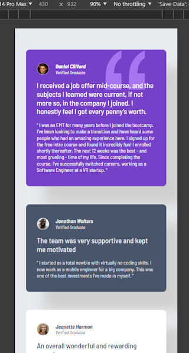
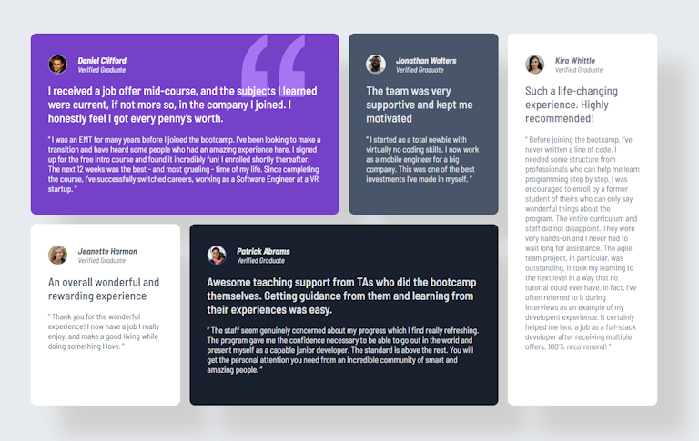

# Testimonials grid project

This is my implementation of  the [Testimonials grid section challenge on Frontend Mentor](https://www.frontendmentor.io/challenges/testimonials-grid-section-Nnw6J7Un7). 
Frontend Mentor challenges help you improve your coding skills by building realistic projects. 

## Table of contents

- [Overview](#overview)
  - [Screenshot](#screenshot)
  - [Links](#links)
- [My process](#my-process)
  - [Built with](#built-with)
  - [What I learned](#what-i-learned)
  - [Continued development](#continued-development)
  - [Useful resources](#useful-resources)
  - [AI Collaboration](#ai-collaboration)
- [Author](#author)
- [Acknowledgments](#acknowledgments)

**Note: Delete this note and update the table of contents based on what sections you keep.**

## Overview

### Screenshot

#### Mobile view



#### Desktop view



### Links

- Solution URL: 
- Live Site URL: 

## My process

### Built with

- Semantic HTML5 markup
- CSS custom properties
- CSS Grid
- Mobile-first workflow
- [LightningCSS](https://lightningcss.dev/)
- [Bun](https://bun.com/)

### What I learned

I learned that bun can build a static site, but you need to have a `.ts` file present for 
it to work cleanly. It also flattens the directory structure. Better to use it with Vite.

Slightly more challenging to keep the `html` semantic.

```html
<article class="ref ref-daniel">
  <header class="byline">
    
    <address>
      <h1>Daniel Clifford</h1>
      <!-- ... Other markup  -->
```

Getting the quote `svg` to sit in only one card in the top right hand corner, and behind the paragraph
involved some experimentation with positioning and z-index.

```css
.ref {
    position: relative;
    /* Other styles */
}

.quote {
    position: absolute;
    /* Other styles */
}


.blurb {
    position: relative;
    z-index: 10;
    /* Other styles */
}
```

- The `.ref` class is the container class for the testimonial (aka. reference).
- The `.quote` is the class on the `svg` image of the quotation mark.
- the `.blurb` class is on the top paragraph of the testimonial, and brings the paragraph forward above the image.

### AI Collaboration

I only made use of AI in the browser for finding and confirming techniques. 

## Author

- Frontend Mentor - [@yourusername](https://www.frontendmentor.io/profile/yourusername)
